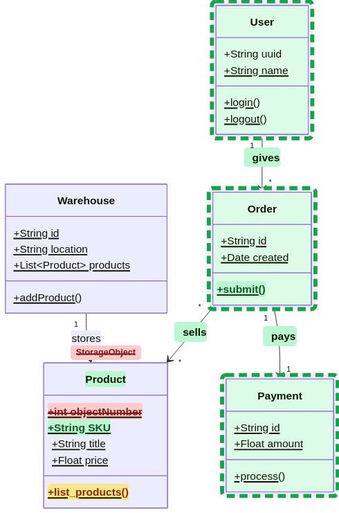

# Mermaid-Klassendiagramm mit Markup (POC)

## Warum das zu meinem Konzept *Mobile-first Review* passt

Ich habe in [Mobile-first AI-Review-App (Konzept)](https://github.com/mjairuobe/Mobile-first-AI-Review-App-Konzept-) beschrieben, dass Mobile-First Tools für Softwareentwicklung fehlen, was im AI Zeitalter jedoch von größerer Bedeutung sein kann. Der Schwerpunkt beim Entwickeln von Software rückt ohnehin vom bloßen Tippen zur hin zur Softwarearchitektur – das sind Denkprozesse. Denken kann man von überall aus.

Um sich schneller Überblick über große Codebasen zu schaffen, halte ich interaktive Klassendiagramme mit Markups für sinnvoll. 

## Klassendiagramm mit Markups

Mithilfe von Klassendiagrammen lassen sich Ausgaben von `git diff` übersichtlicher darstellen. So können Änderungen in größere unbekannte Codebasen schnell erfasst werden. 

## Ausblick: Interaktive Klassendiagramme

Mit wachsender Codebasis werden Visualisierungen von Klassenhierarchien schnell sehr groß. Ein großes Diagramm auf einem Smartphone ist ebenfalls nicht sehr übersichtlich.

Das Ziel von einer Interaktion mit Klassendiagrammen ist:

- Klassendiagramme automatisch bei einem Commit generieren

- per Klick nahtlos in die geänderten Code einer Methode springen (hier z. B. list_products) – Tools wie [snappify](https://snappify.com) visualisieren Quellcode sehr ansehnlich

- zwei Ansichten: Gesamtansicht der Klassenhierarchie oder responsiver: einer einzelnen Klasse – eine Klasse lässt sich gut auf einem Smartphonebildschirm darstellen

- die Darstellung in einem Canvas mit Pan/Zoom Funktionalität

- beim Klick auf Implementationspfeilen oder Relations kann zu der Ansicht anderer Objekte gesprungen werden (z. B. beim Betrachten der Product-Klasse wird beim Klick auf die `sells`Relation ein Übergang zu der Order-Klasse animiert)
